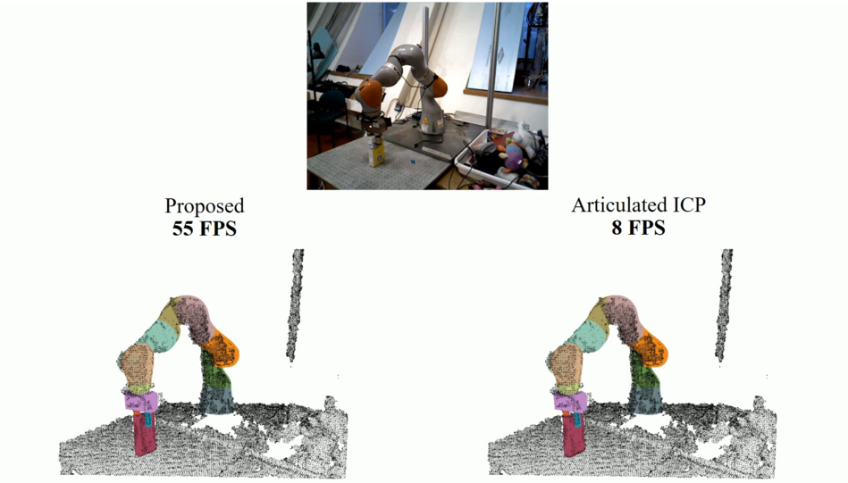

# [FilterReg](<https://sites.google.com/view/filterreg/home>)

A reference implementation for the paper: 

Wei Gao and Russ Tedrake, "FilterReg: Robust and Efficient Probabilistic Point-Set Registration using Gaussian Filter and Twist Parameterization", CVPR 2019 (**Oral**)  [[Project]](<https://sites.google.com/view/filterreg/home>) [[Paper]](https://arxiv.org/abs/1811.10136) [[Supplemental]](https://drive.google.com/file/d/1R_E-v3vh7aq3uwg_EOmZEtItMn649rVI/view?usp=sharing)

In addition to FilterReg, this repo contains the implementation of various geometric processing algorithms. This repo aims at real-time tracking and geometric processing for robotic manipulation, visual odometry and SLAM (3D Reconstrution).

### Video Demo [[Link]](https://youtu.be/k-YQVZfM0qg)

[](https://youtu.be/k-YQVZfM0qg)

### Build Instruction

The code is developed on Ubuntu 16.04 with `CUDA-9` and `CUDA-10`. The tested compilers are `gcc-5.4`, `gcc-6.0` and `gcc-6.5`. Note that `gcc-5.5` is not supported by CUDA and may cause errors. For the installation of CUDA, please follow the [official guide](<https://developer.nvidia.com/cuda-downloads>).

This repo depends on `pcl` and `opencv`. The default versions of both Ubuntu 16.04 and `ros-kinetic` have been tested. For Ubuntu 16.04, you can run the following command to install them

```shell
sudo apt-get install libpcl-dev libopencv-dev
```

This repo also depends on `glog` which can be installed by

```shell
sudo apt-get install libgoogle-glog-dev
```

Now you are ready to build

```shell
git clone https://gaowei19951004@bitbucket.org/gaowei19951004/poser-public.git
cd ${project_root}
mkdir build && cd build
cmake .. -DCMAKE_BUILD_TYPE=Release
make
```

The [`apps/rigid_pt2pt`](<https://sites.google.com/view/filterreg/home>) would be a good starting point. The test data is also included in that subdirectory. Other execultables in `apps` subfolder have a very similiar code structure.

### TODO

The code is re-factored from a pretty messy version which is the backbone of all the experiments in our paper. Not all the code has been adapted into this repository and the author is working on it. Here is a list of TODOs:

- [ ] The GPU implementation of various algorithms.
- [ ] Revive the articulated kinematic model using the new MultiBodyTree in drake.
- [ ] The deformable kinematic model is currently in another repo (SurfelWarp).

### FAQ

- How to switch the compiler to `gcc-6` in `cmake`?

  Run `source use_gcc6` before any `cmake` command. You might need to remove the `CMakeCache.txt` in your build directory.

### Contact

If you have any question or suggestion regarding this work, please send an email to weigao@mit.edu